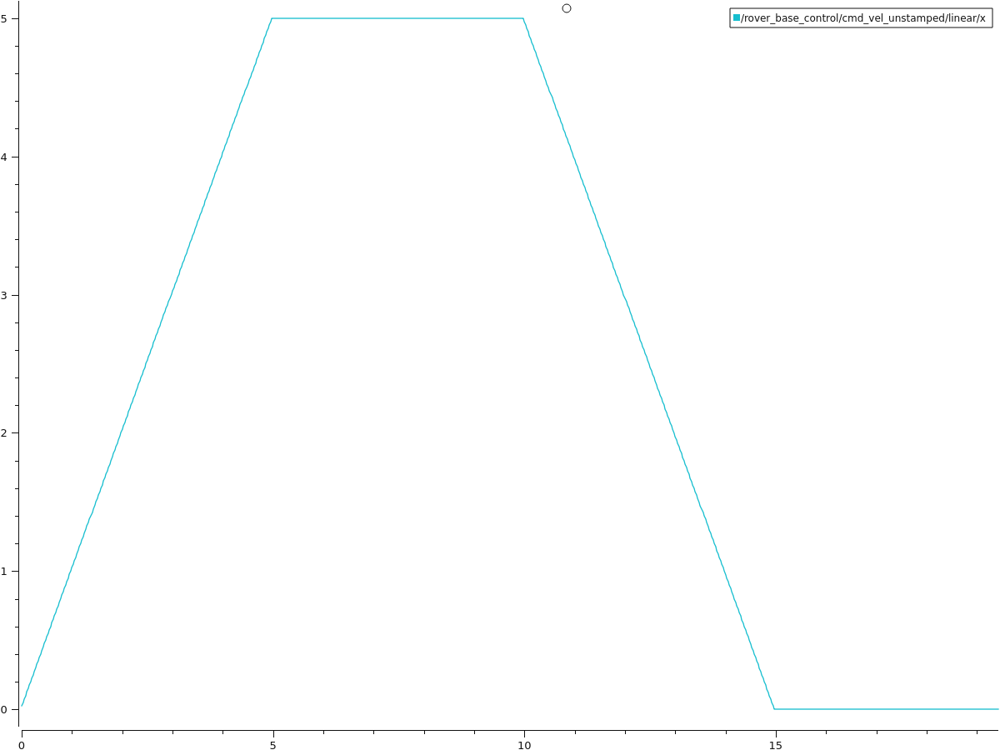
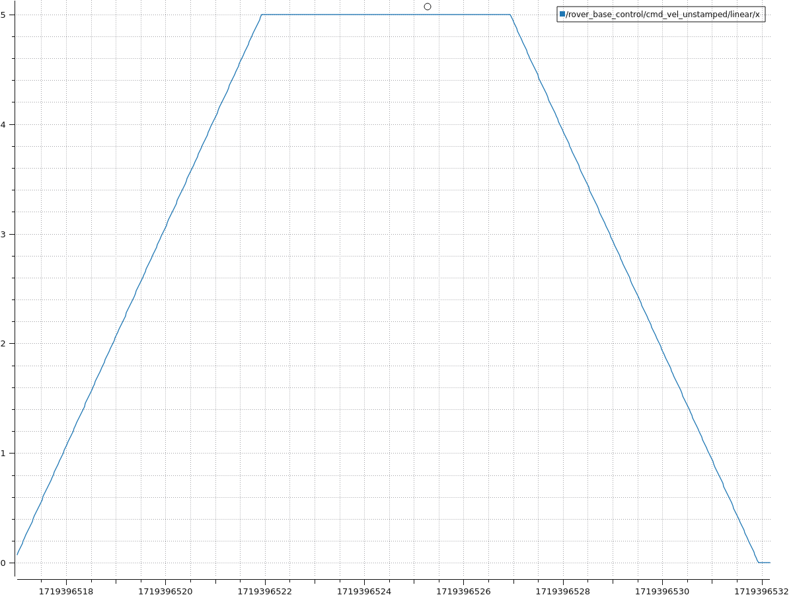

# Práctica 3 – Parte B: Integración y estudio de dinámicas en Gazebo y ROS2

### Gráficas Velocidad

    

    

Debido a la forma de robot modelado en la mayoría de los casos no habrá colisión con los obstaculos y la velocidad seguirá la gráfica velocidad-tiempo que se pide. En el caso de una colision el robot detendrá todo su movimiento.

### Videos ejecución nodo **speed_controller.cpp**

* Ejemplo de chocque:

### Enlaces ROSBags

* [Rosbag escenario *Floor*](https://urjc-my.sharepoint.com/:f:/r/personal/i_peral_2021_alumnos_urjc_es/Documents/rosbag_floor?csf=1&web=1&e=n7CfOi)

* [RosBag escenario *sand*](https://urjc-my.sharepoint.com/:f:/r/personal/i_peral_2021_alumnos_urjc_es/Documents/rosbag_sand?csf=1&web=1&e=ogS9vi)
